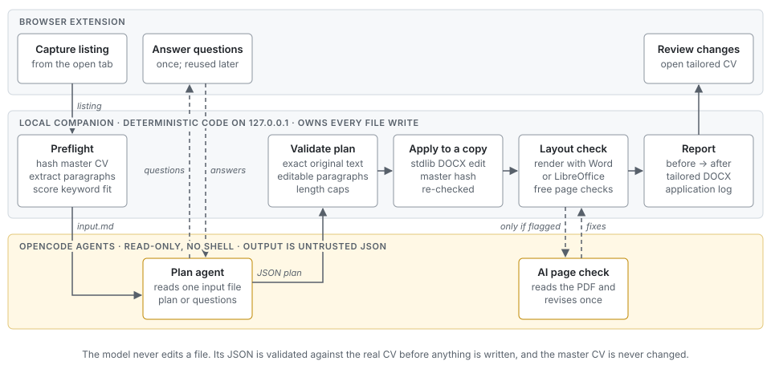

# CV Tailor

Tailor your CV to a job listing from the browser, without letting an LLM invent experience.

A Chrome/Edge extension captures the listing you have open. A small local companion asks an LLM (through [OpenCode](https://opencode.ai)) for a *plan* of paragraph rewrites, **validates that plan against your real CV**, applies it to a **copy** of your master DOCX, and checks the layout. Nothing is submitted for you, and nothing leaves your machine except the prompts sent to the model you choose.

> Status: early release (0.1.0). Built with AI assistance and reviewed by its author. See [Limitations](#limitations).

## Why it is built this way

LLM-written CVs fail in two ways: they fabricate, and they wreck formatting. This project makes both hard:

- **The model never touches the file.** It returns JSON; deterministic code validates every replacement (the original text must match your CV exactly, only editable paragraphs may change, length is capped) and applies it to a copy.
- **Your master CV is protected.** Its SHA-256 is recorded before processing and verified after every stage; the OpenCode agents are read-only and have no shell.
- **It asks instead of guessing.** Missing facts become one batch of clarification questions. Your answers are stored with their questions and reused, so you are not asked twice.
- **Layout is checked for free first.** Page count and awkward breaks are checked locally; the AI only looks at the PDF if something is flagged.
- **Accuracy rules live in one file** (`CV_TAILORING_AGENT.md`) that you can read and change.

## How it works

<picture>
  <source media="(prefers-color-scheme: dark)" srcset="docs/architecture-dark.svg">
  
</picture>

The details, including each module and the trust boundaries, are in [docs/ARCHITECTURE.md](docs/ARCHITECTURE.md).

## Measured token use

With the default settings, a job whose layout check passes uses one planning run of about **9,500 tokens**. The AI page check and the cover letter run only when needed or asked for.

| Agent | Runs | Median tokens | Range | Median time |
| --- | --- | --- | --- | --- |
| Planning (`cv-tailor`) | 6 | 9,503 | 9,218–9,545 | 14 s |
| AI page check (`cv-tailor-qa`) | 5 | 7,150 | 7,047–11,019 | 14 s |
| Cover letter (`cv-tailor-letter`) | 5 | 6,498 | 6,410–6,526 | 13 s |

**Method.** Five jobs were run one after another on 3 October 2026 at commit `398a8a1`, in a fresh workspace from `cv-tailor init --sample`. Each job used the fictional sample CV (17 paragraphs, one page) and `examples/sample_job.txt`. The model was `openai/gpt-6-luna` at variant `medium` through OpenCode, rendering with Word on Windows. `ai_qa_mode` was set to `always` so that every job also measured the page check, and a cover letter was requested for each job. The figures are OpenCode's own token counts for each model call, summed per agent run by `cv-tailor usage`. The total includes cached input; about three quarters of the planning tokens were input the provider served from its prompt cache. The first job asked clarification questions once, so it planned twice. Its answer was stored, and the other four jobs planned once.

**Limits.** All five plans recommended no changes, because the sample CV already covers the sample listing. A plan with edits produces more output tokens. A real CV is longer than the sample, so its input is larger. Run `cv-tailor usage` in your own workspace to see your figures.

## Quick start

Requires Python 3.11+, [OpenCode](https://opencode.ai) signed in to a model provider, and Chrome or Edge.

```bash
pip install -e .                      # from a clone of this repository
cv-tailor init ~/cv-tailor-workspace --model provider/model --sample
cd ~/cv-tailor-workspace
cv-tailor doctor                      # checks everything is in place
cv-tailor serve
```

List the models you can use with `opencode models`. `--sample` creates a fictional master CV so you can try the tool; to use your own, replace `data/master_cv.docx`.

Then load the extension: open `chrome://extensions`, enable **Developer mode**, choose **Load unpacked**, and select the `extension/` folder. Open a job listing and click **Send current job**.

Your workspace holds all personal data (`cv-tailor.json`, `data/`). Keep it outside this repository.

## Page rendering

| Backend | Where | What you get |
| --- | --- | --- |
| `word` | Windows with Microsoft Word | Exact per-paragraph page positions and PDF |
| `libreoffice` | Windows, macOS, Linux | PDF and page count; paragraph positions if `pip install pypdf` |
| `none` | anywhere | Tailoring works; layout checks and PDF review are skipped |

`render_backend: "auto"` (default) picks Word, then LibreOffice, then none.

## Configuration

`cv-tailor.json` in the workspace. Unknown keys and unsafe values are rejected with a clear message.

| Key | Default | Meaning |
| --- | --- | --- |
| `opencode_model` | *(required)* | `provider/model` used for tailoring |
| `agent_models`, `agent_variants` | `{}` | Per-agent model and reasoning effort (agents: `cv-tailor`, `cv-tailor-revise`, `cv-tailor-qa`, `cv-tailor-letter`). The QA agent reads a PDF, so choose a model that accepts PDFs |
| `render_backend` | `auto` | `auto`, `word`, `libreoffice`, `none` |
| `min_fit_score` | `20` | Below this keyword fit the job waits for confirmation (`0` disables) |
| `ai_qa_mode` | `on_failure` | `always` to have the AI inspect every PDF |
| `use_templates` | `true` | Offer the last plan for a similar role as a starting point |
| `candidate_name` | *(from CV)* | Prefix for output filenames |
| `port` | `8765` | Loopback only; if you change it, set the same port in the extension under **Companion connection** |

`cv-tailor usage` lists the tokens each agent run used, as OpenCode reported them, with the median per agent and per job.

## Safety model

- The companion binds to `127.0.0.1` only and requires a generated bearer token. Pairing is accepted only from a `chrome-extension://` origin.
- Autofill never touches passwords, demographic or diversity questions, date of birth, identity numbers or pay, never overwrites a filled field, and never submits.
- Agents are read-only, have no shell, and are told to read a single input file.
- A usage-limit error pauses the queue and resumes after the reset rather than failing.
- The log (`data/runtime/companion.log`, rotated at 1 MB, four files kept) records job ids, states, agent exit codes, timings and token counts, never CV text, listings or your answers. Each failed job also keeps its traceback in `companion-error.log` in its job folder.

## Troubleshooting

`GET http://127.0.0.1:8765/health` (no token needed) reports the running version and which page renderer was found. Each log line is `key=value` fields tagged with a job id, so one job's history is a search away:

```bash
grep "job=20261003-181000-daa27e0e" data/runtime/companion.log
```

## Development

```bash
uv venv && uv pip install -e ".[dev]"
python -m unittest discover -s tests -p "test_*.py"   # companion
node --test tests/*.test.mjs                           # extension
ruff check .
python -m mypy                                         # strict type check
uvx pre-commit install                                 # lint, file hygiene and secret scan on each commit
```

The suite includes an end-to-end run with a stand-in for OpenCode, so it needs neither network nor Word. The LibreOffice render test runs when `soffice` is installed and is skipped otherwise.

CI (`.github/workflows/ci.yml`) runs the tests on Linux, macOS and Windows with Python 3.11 to 3.14, lints with ruff, checks the extension, and renders the sample CV with LibreOffice on Ubuntu. Gitleaks scans the full history on every push and weekly; Dependabot keeps the SHA-pinned actions and Python extras up to date. `tests/smoke_browser_connection.mjs` is a manual check of the real extension in an isolated browser profile: run `node tests/smoke_browser_connection.mjs <path to Chrome or Edge>` with a companion running. Set `CV_TAILOR_PORT` to test a companion on a non-default port; this also exercises the extension's port setting.

Layout: `cv_tailor/` (companion), `extension/` (browser extension), `cv_tailor/templates/` (agent prompts and guardrails copied into each workspace), `docs/` (design notes).

## Limitations

- Paragraph-level edits only; paragraphs containing tabs, hyperlinks, fields, text boxes or tracked changes are locked.
- Mixed formatting inside a rewritten paragraph collapses to its first run's formatting.
- The extension is not published to a web store; load it unpacked.
- Free-text application questions are left for you. Autofill covers standard fields.
- LibreOffice layout checks without `pypdf` cover page count only.

## Licence

MIT. The bundled Geist font is under the SIL Open Font Licence (`extension/fonts/OFL.txt`). The architecture diagram embeds a subset of Cascadia Code, also under the SIL Open Font Licence.
