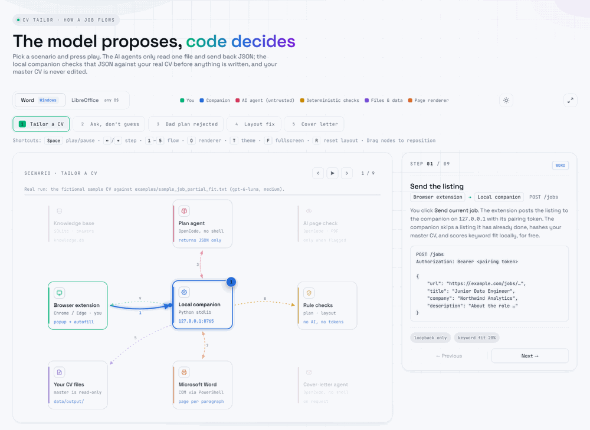

# Architecture

<a href="https://chika256.github.io/CV-Tailor/architecture.html"><picture>
  <source media="(prefers-color-scheme: dark)" srcset="architecture-dark.gif">
  
</picture></a>

**[Open the interactive version](https://chika256.github.io/CV-Tailor/architecture.html)**, served by GitHub Pages from [`architecture.html`](architecture.html) in this folder: pick a scenario, step through it, and see the real payload at each step. The flows below describe the same scenarios in text.

## Components

| Part | Responsibility |
| --- | --- |
| `extension/` | Captures the listing, shows job status, autofills forms, opens results. Talks only to the companion on `127.0.0.1`. |
| `cv_tailor/server.py` | Entry point for `cv-tailor serve`: configures logging, starts the companion and the HTTP API. |
| `cv_tailor/api.py` | Loopback HTTP API for the extension: pairing, bearer-token auth, CORS and routes. |
| `cv_tailor/companion.py` | Job queue and its single worker thread, the tailoring pipeline, usage-limit pauses. |
| `cv_tailor/agents.py` | Runs OpenCode agents: builds the command, runs the process, detects usage limits, parses the JSON reply. |
| `cv_tailor/intake.py` | Validates a listing submitted by the extension before it becomes a job. |
| `cv_tailor/reports.py` | Writes each job's before/after report; reads the clarification questions saved with a job. |
| `cv_tailor/usage.py` | Sums the token counts OpenCode reports for each agent run into the job's `usage.json`; `cv-tailor usage` reports them. |
| `cv_tailor/logs.py` | One-line `key=value` log events tagged with the job being processed. |
| `cv_tailor/docx_io.py` | Reads and edits DOCX paragraphs with the standard library. Copies every other package part byte for byte. |
| `cv_tailor/docx_ops.py` | Validates tailoring plans and QA results; JSON helpers. |
| `cv_tailor/prep.py` | Builds each agent's single input file, cleans listings, fingerprints jobs, scores keyword fit, checks layout, writes cover-letter DOCX. |
| `cv_tailor/render.py` | Renders a DOCX to PDF and page facts via Word, LibreOffice or nothing. |
| `cv_tailor/knowledge.py` | SQLite store of answers, notes, other-CV evidence and the application log. |
| `cv_tailor/applicant.py` | Editable applicant profile used by autofill. |
| `cv_tailor/templates/` | Agent prompts and `CV_TAILORING_AGENT.md`, copied into a workspace by `cv-tailor init`. |

## Flows

The companion is the hub: it makes every call. The agents read the one input file they are given and reply with JSON; they never call each other or the browser, and never write a file. Each scenario in the interactive diagram is listed here step by step.

**1. Tailor a CV.** (1) The extension posts the listing to `POST /jobs`; the companion skips a repeat, hashes the master CV and scores keyword fit locally. (2) It writes `input.md` and runs the plan agent, which may read only that file. (3) The agent returns `result.json`: replacements with each paragraph's exact current text, plus requirements the CV cannot support. (4) `validate_tailoring_result` checks every replacement against the CV. (5) `docx_io.apply_plan` applies the plan to a copy; the master's hash is re-checked. (6, 7) The renderer turns the copy into a PDF and returns page facts in `layout.json`. (8) `deterministic_layout_issues` checks page count, split paragraphs, stranded headings and lone bullets. (9) The popup shows the result, the change report and the tailored CV.

**2. Ask, don't guess.** When the CV lacks evidence for a requirement, the plan agent returns `needs_clarification` with up to ten questions instead of a plan. The job pauses, the popup shows the questions, and `POST /jobs/<id>/answers` stores the answer with its questions in the knowledge base (`knowledge.record_answers`). The plan agent runs again with the answer in its input, and later jobs get it from `knowledge.snapshot` without asking.

**3. Bad plan rejected.** A replacement that names a locked paragraph, misquotes the CV's text, runs too long, pushes the plan past 40 changes or 700 added characters, or removes a paragraph that may not be removed (anything but a project or experience bullet with a sibling, more than six bullets, or every bullet of an entry) raises `PlanError`. The job fails with that reason before any file is written, and the master CV is unchanged.

**4. Layout fix.** Only when the free layout checks flag something (or with `ai_qa_mode: "always"`) does the AI page check get `qa_input.md` and `preview.pdf`. If it reports the CV is not ready, the revision agent receives the problems and the current plan in `revise_input.md` and returns `revised-result.json`, which is validated, applied to a fresh copy, rendered and checked like the first plan. One revision is allowed by default (`qa_revision_attempts`); if problems remain, the job completes with a warning.

**Page limit.** With `max_pages` (2 by default), a rendered CV over the limit skips the AI page check, since the page count alone settles it, and goes straight to the revision agent. Both agents see the limit in their input file, and the CV listing marks with `x` the bullets they may remove: project and experience bullets that have a sibling. A removal is a replacement with `"remove": true` and no `new_text`; `docx_io.apply_plan` deletes that paragraph from the copy.

**5. Cover letter.** `POST /jobs/<id>/cover-letter` runs the letter agent on the same kind of input file. It returns `letter.json` (salutation, paragraphs, closing), which the companion writes as a DOCX beside the tailored CV.

**Renderer modes.** The toggle in the interactive diagram switches the page renderer. Word (Windows) reports the page every paragraph starts and ends on, so every layout check runs. LibreOffice (any OS) reports the page count, and paragraph positions only when `pypdf` is installed; without it, only the page count is checked.

## Job lifecycle

1. The extension posts the listing. The companion validates it, fingerprints it (a repeat returns the earlier job) and queues it.
2. **Preflight:** hash the master CV, extract its paragraphs to `cv.json`, score keyword fit locally.
3. **Plan:** write `input.md` (cleaned listing, paragraph list, answers, trimmed knowledge base, optional prior plan). One OpenCode agent reads it and returns JSON: a plan, or clarification questions.
4. **Validate:** every replacement must name an editable paragraph and quote its current text exactly; length and total growth are capped.
5. **Apply:** `docx_io.apply_plan` writes a copy under `data/output/`. The master hash is re-checked.
6. **Check:** render, then free structural checks (page count, split paragraphs, stranded headings, lonely bullets). Only on a flag does an AI agent inspect the PDF, and one revision pass is allowed.
7. **Report:** a before/after change report, status, and an entry in the application log.

## Trust boundaries

- The LLM output is untrusted data: it is parsed as JSON and validated before anything is written.
- The agents run read-only with web tools limited to company research in the planning agent.
- Workspace paths (`runtime`, `output`, `cv_library`, `master_cv`) must stay inside the workspace.
- The companion is loopback-only; the bearer token lives in `data/runtime/companion_state.json`.

## Data

Everything personal lives in the workspace, never in this repository: `cv-tailor.json`, `data/master_cv.docx`, `data/cv_library/`, `data/runtime/` (jobs, `knowledge.db`, `profile.json`, templates) and `data/output/`.
